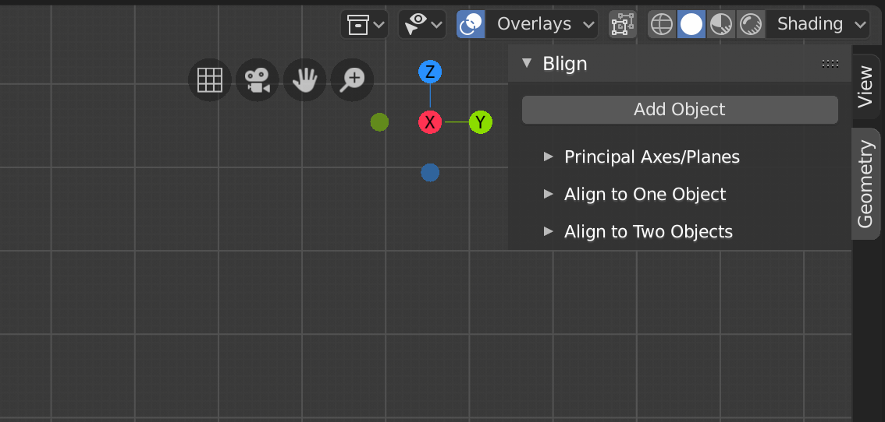
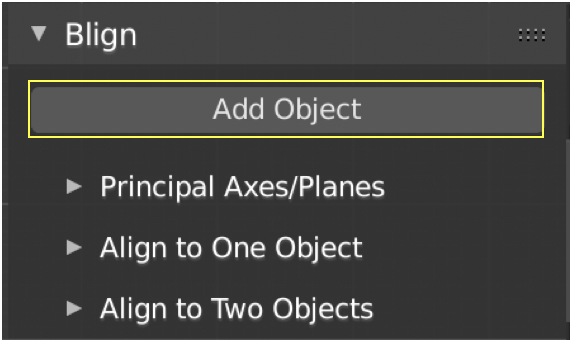
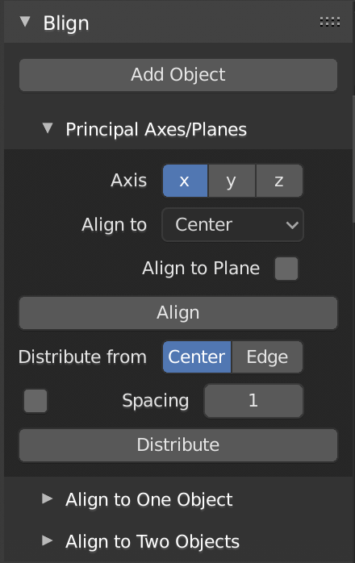
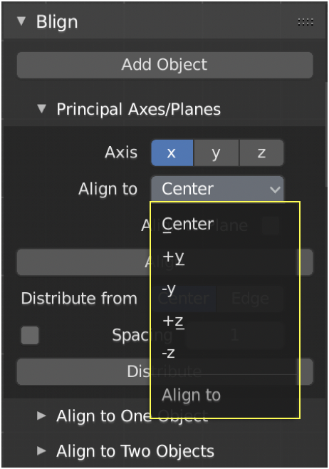
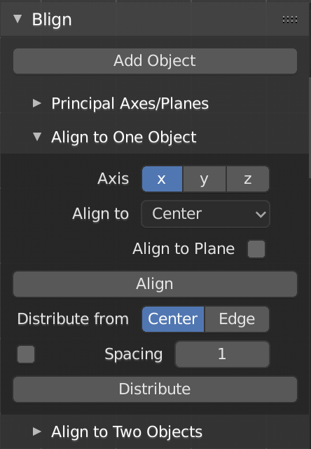
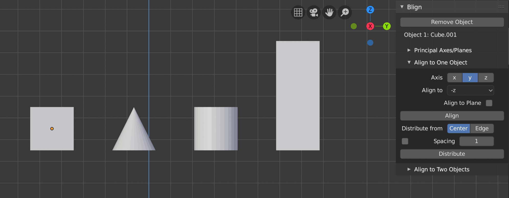
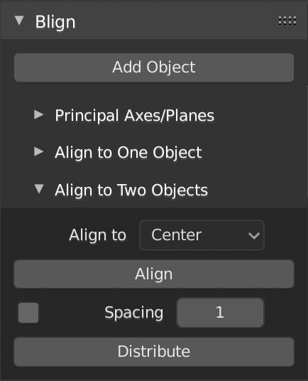

# Blign Tutorial Video
<a href="https://www.youtube.com/watch?v=Xren9U6GPFI&feature=youtu.be">Blign Tutorial</a>

# Introduction
Blign is an alignment and distribution tool for Blender v2.80. It allows users to align and distribute shapes with many different options. Once installed, it can be found in the N-Panel (by pressing the n key) under the Geometry sidebar. 

# Add Object

The Add Object button allows users to select an object and set it as a Blign object. Either one or two objects can be set as a Blign object, and depending on how many are added, different options are available. Once an object has been added the user is given the option to unset it as a Blign object with the Remove Object button. Once an object is added it's name will appear below the Add/Remove Object button.

# Principal Axes/Planes

Blign has three different tabs, each can be used depending on how many objects are added. The Principal Axes tab is to be used when no objects have been added. Within this tab the user has the option to align objects on either the x, y, or z axis. Once the Align button is pressed, all selected object will be moved. The user also has the option to align objects from their centers, or from their most positive or negative x, y, or z points. Depending on which axis is selected, some of these options may not be available. Shown below is an example of the "Align to" options available to the user when the x axis is selected.

These points are found using the object's bounding box. Within this tab, the user also has the option to distribute objects, either from their centers or from their edges. By default, Blign will evenly space objects between the first and last object in space. Users also have the option to specify the distance between objects by checking the box next to the "Spacing" button. Blign also has the option to align objects to planes. By checking the "Align to Plane" button the "Axis" menu will become the "Plane" menu giving users the option to align objects to the y-z, x-z, or x-y plane.

# Align to One Object

This tab is to be used when one object has been added. This tab is has the same options as the Principal Axes tab, except the Align button now aligns objects to where the Blign object is in space. Shown below is an example of 3 different objects being aligned to a cube (highlighted), which has been added as a Blign object. The most negative z (-z) points of each objects are aligned to one another.

# Align to Two Objects

This tab is to be used when two objects have been added. When the Align button is clicked, all selected objects will be moved to the closest point on the line between the centers of the 2 Blign objects. Objects can also be aligned outside of the two Blign objects, still along the same line. Users can also distribute objects within this tab. When the Distribute button is clicked, by default Blign will evenly space objects along the same line between the first and last object. Users can also specify the distance between each object by checking the box next to the spacing button. Currently, objects can only be distributed from their centers when two objects have been selected. 
